<div align="center">
  
# Anil Kumar | @crazyscriptright

[](https://git.io/typing-svg)

### *"Code. Break. Learn. Secure."*

[](https://anils-portfolio.vercel.app)
[](https://www.linkedin.com/in/anil-anil/)
[](https://github.com/crazyscriptright)

</div>

---

<div align="center">

##  About Me

</div>

```python
class SecurityEngineer:
    def __init__(self):
        self.name = "Anil Kumar"
        self.role = "Cybersecurity Enthusiast & Full-Stack Developer"
        self.location = "India"
        self.interests = ["Web Security", "Penetration Testing", "MERN Stack", "AI"]
        self.learning = ["Advanced Web Exploitation", "Cloud Security", "DevSecOps"]
        
    def say_hi(self):
        print("Thanks for dropping by! Let's build secure & scalable solutions together!")

me = SecurityEngineer()
me.say_hi()
```

- Passionate about **Cybersecurity, Web Security & Ethical Hacking**
- Building robust applications with **MERN Stack** (MongoDB, Express, React, Node.js)
- Focused on creating **secure, scalable, and user-friendly** web applications
- Currently diving deep into **Web Application Security** and **Cloud Computing**
- **Fun fact**: I love breaking things just to fix them better
- Open to collaborating on **security tools**, **penetration testing labs**, and **innovative web projects**

---

<div align="center">

##  Featured Project

</div>

###  [XploitLab.me](https://xploitlab.me)
> **A Comprehensive Cybersecurity Learning & Testing Platform**

**What is XploitLab?**
- **Hands-on Security Lab**: Practice real-world penetration testing in a safe environment
- **Learning Platform**: Structured challenges for beginners to advanced security enthusiasts
- **CTF Challenges**: Capture The Flag competitions to test your skills
- **Security Tools**: Custom-built tools and utilities for ethical hacking
- **Progress Tracking**: Monitor your learning journey and skill development

**Tech Stack**: MERN Stack, Security Tools Integration, Docker, Cloud Infrastructure

[](https://xploitlab.me)

---

<div align="center">

##  Tech Stack & Tools

### Languages

<p align="center">
  
  
  
  
  
  
  
  
  
</p>

### Frameworks & Libraries

<p align="center">
  
  
  
  
  
  
  
  
  
</p>

### Cybersecurity Tools


### Cloud & DevOps

<p align="center">
  
  
  
  
  
  
  
</p>

</div>

---

<div align="center">

##  GitHub Statistics

<a href="https://github.com/anuraghazra/github-readme-stats">
  
</a>
<a href="https://github.com/anuraghazra/github-readme-stats">
  
</a>

<a href="https://git.io/streak-stats">
  
</a>

</div>

---

<div align="center">

##  Contribution Graph

<picture>
  <source media="(prefers-color-scheme: dark)" srcset="https://raw.githubusercontent.com/crazyscriptright/crazyscriptright/output/github-contribution-grid-snake-dark.svg">
  
</picture>


</div>

---

<div align="center">

##  What I'm Up To

</div>

- Building **XploitLab.me** - A comprehensive cybersecurity learning platform
- Deepening my knowledge in **Advanced Web Exploitation** and **Cloud Security**
- Looking to collaborate on **open-source security tools** and **MERN stack projects**
- Ask me about **Web Security**, **MERN Development**, **Penetration Testing**, or **CTFs**
- Reach me at: [Portfolio](https://anils-portfolio.vercel.app) | [LinkedIn](https://www.linkedin.com/in/anil-anil/)
- **Fun fact**: I love breaking things just to fix them better

---

<div align="center">

##  Current Focus

</div>

```javascript
const currentGoals = {
  2026: [
    "Master Advanced Web Application Security",
    "Contribute to Open Source Security Projects",
    "Expand XploitLab with more challenges",
    "Learn Cloud Security & DevSecOps",
    "Build more secure MERN applications"
  ]
}
```

---

<div align="center">

##  Let's Connect & Collaborate!

[](https://anils-portfolio.vercel.app)
[](https://www.linkedin.com/in/anil-anil/)
[](https://xploitlab.me)

### Open to opportunities in Cybersecurity & Full-Stack Development!


</div>

---

<div align="center">
  
### *If you find my work interesting, consider giving my repos a star!*

**"The only truly secure system is one that is powered off, cast in a block of concrete and sealed in a lead-lined room with armed guards."**

</div>
